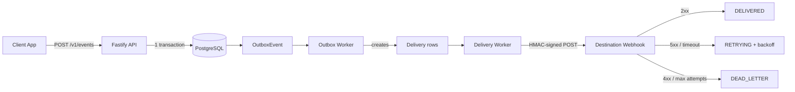

# RelayForge

Cloud-native webhook delivery platform. Ingests events, routes them to subscribed destinations, and guarantees at-least-once delivery with retries, exponential backoff, and dead-letter queue.

Built to explore the same distributed-systems patterns used by Stripe, Segment, and AWS EventBridge.

---

## Why this exists

Sending webhooks reliably is deceptively hard:

- The receiver's server might be down for 30 seconds — you can't drop the event.
- The receiver might respond `200 OK` but silently fail — you need retries.
- The same event might arrive twice — you need idempotency.
- The receiver has to prove the payload came from you — you need signatures.

RelayForge solves all of these using battle-tested patterns.

---

## Architecture



**Data flow:**

1. **Ingestion** — Client POSTs event with an `Idempotency-Key`. Event + OutboxEvent saved in a single DB transaction.
2. **Routing** — Outbox worker polls unprocessed events, matches them to destinations by pattern (`payment.*`, `order.created`, `*`), creates one Delivery row per destination.
3. **Delivery** — Delivery worker picks up `PENDING` deliveries, signs the payload with HMAC-SHA256, sends the webhook.
4. **Retry / DLQ** — 5xx / network errors → exponential backoff (0s, 30s, 2min, 10min, 1h). 4xx → straight to DEAD_LETTER (permanent failure). Max 5 attempts.

---

## Patterns implemented

| Pattern | Where | Why |
|---|---|---|
| **Transactional Outbox** | `events/service.ts` | Guarantees Event + delivery intent are saved atomically. If the worker crashes, nothing is lost. |
| **Idempotency** | Unique constraint `(tenantId, externalEventId)` | Duplicate requests return the same eventId, no double-processing. |
| **HMAC-SHA256 signing** | `lib/hmac.ts` | Receiver can verify the payload came from RelayForge. |
| **Exponential backoff** | `deliveries/service.ts` | Backs off aggressive retries to avoid hammering a struggling receiver. |
| **Dead-letter queue** | `DeliveryStatus.DEAD_LETTER` | Failed deliveries after max attempts (or 4xx) are quarantined for inspection. |
| **Fail-open cache** (planned) | Redis | If Redis is down, system degrades gracefully instead of blocking. |

---

## Stack

- **Node.js 20 + TypeScript** (strict mode)
- **Fastify 5** — HTTP framework (faster than Express, first-class TS support)
- **PostgreSQL 16** via **Prisma ORM** — type-safe DB access
- **Redis 7** — planned for rate limiting and dedup cache
- **Docker Compose** — local infra
- **Vitest** — unit + integration tests
- **MSW** — HTTP mocking for delivery tests
- **Zod** — runtime validation of API inputs

---

## Getting started

```bash
# 1. Clone and install
git clone https://github.com/YOUR_USERNAME/relayforge.git
cd relayforge
npm install

# 2. Copy env
cp .env.example .env

# 3. Start Postgres + Redis
docker-compose up -d

# 4. Run migrations + seed test tenant
npx prisma migrate deploy
npm run prisma:seed
# ^ prints your API key. Save it.

# 5. Run the API + workers
npm run dev
```

In a second terminal, run the fake receiver:

```bash
npx tsx src/chaos-server.ts
```

Then send an event:

```bash
curl -X POST http://localhost:3000/v1/events \
  -H "Authorization: Bearer YOUR_API_KEY" \
  -H "Idempotency-Key: evt_test_1" \
  -H "Content-Type: application/json" \
  -d '{"type":"payment.approved","data":{"amount":100}}'
```

---

## API

### `POST /v1/events`

Ingest a new event.

**Headers:**
- `Authorization: Bearer <api_key>` — required
- `Idempotency-Key: <string>` — required. Same key = same event, no duplicates.
- `Content-Type: application/json`

**Body:**
```json
{
  "type": "payment.approved",
  "source": "billing-service",
  "data": { "amount": 100, "currency": "usd" }
}
```

**Response 202:**
```json
{ "eventId": "uuid", "status": "accepted" }
```

### Webhook payload (sent to destinations)

**Headers:**
- `X-RelayForge-Event-Id: <uuid>`
- `X-RelayForge-Signature: sha256=<hex>` — HMAC-SHA256 of body using destination secret

**Body:** JSON with `eventId`, `type`, `data`.

---

## Testing

```bash
npx vitest run
```

**12 tests across 3 suites:**
- `matchesPattern` — unit tests for event routing (6 tests)
- `createEvent` — integration tests for idempotent ingestion (2 tests)
- `deliverOne` — integration tests for delivery + retry + DLQ using MSW (4 tests)

Integration tests use a separate `relayforge_test` database to avoid polluting dev data.

---

## Project structure

```
src/
├── app.ts                          Fastify app assembly
├── server.ts                       Entry point (HTTP + workers)
├── chaos-server.ts                 Fake webhook server for local testing
├── config/env.ts                   Env validation (Zod)
├── lib/
│   ├── prisma.ts                   Prisma singleton
│   ├── redis.ts                    Redis singleton
│   ├── hash.ts                     API key hashing
│   └── hmac.ts                     Webhook payload signing
├── plugins/auth.ts                 API key auth (injects tenant into request)
├── modules/
│   ├── events/                     Event ingestion + routing
│   │   ├── routes.ts               POST /v1/events
│   │   └── service.ts              createEvent, matchesPattern, processOutboxEvent
│   └── deliveries/
│       └── service.ts              deliverOne (HTTP + retry logic)
└── workers/
    ├── outbox-worker.ts            Polls OutboxEvent, creates Deliveries
    └── delivery-worker.ts          Polls PENDING/RETRYING Deliveries, sends webhooks

prisma/
├── schema.prisma                   8 models (Tenant, ApiKey, Destination,
│                                   Subscription, Event, Delivery,
│                                   DeliveryAttempt, OutboxEvent)
└── seed.ts                         Creates test tenant + API key
```

---

## Roadmap

- [x] Ingestion API with idempotency
- [x] Transactional outbox
- [x] Event routing (pattern matching)
- [x] HMAC-signed delivery
- [x] Retry with exponential backoff
- [x] Dead-letter queue
- [x] Unit + integration tests
- [ ] Rate limiting per tenant (Redis)
- [ ] Admin API to list/replay dead-letter deliveries
- [ ] Metrics endpoint (Prometheus)
- [ ] Deploy to Fly.io with Postgres + Redis
